# System Architecture

## Goal

The system is designed to detect suspicious product reviews directly in the browser and return an explainable result that can later be reviewed by a human annotator.

## High-Level Components

### 1. Chrome Extension

Location: [client](C:/Users/37369/OneDrive/Рабочий%20стол/fake-review-detector/client)

Responsibilities:

- capture highlighted text from a web page
- trigger review analysis from the popup
- display verdict, confidence, and evidence text

Key files:

- [client/content.js](C:/Users/37369/OneDrive/Рабочий%20стол/fake-review-detector/client/content.js)
- [client/popup.js](C:/Users/37369/OneDrive/Рабочий%20стол/fake-review-detector/client/popup.js)
- [client/popup.html](C:/Users/37369/OneDrive/Рабочий%20стол/fake-review-detector/client/popup.html)

### 2. FastAPI Backend

Location: [server/main.py](C:/Users/37369/OneDrive/Рабочий%20стол/fake-review-detector/server/main.py)

Responsibilities:

- receive review text from the extension
- run model inference
- prepare explainable response
- store all analyzed reviews in SQLite
- expose a manual labeling dashboard
- export confirmed labels for retraining

Core endpoints:

- `POST /analyze`
- `GET /health`
- `POST /feedback`
- `GET /reviews`
- `GET /reviews/recent`
- `GET /reviews/export-confirmed`

### 3. ML Model Layer

The classifier is based on a fine-tuned DistilBERT architecture and is loaded from a local model directory, for example `server/model_mixed`.

Responsibilities:

- tokenize input text
- infer class logits
- apply calibrated confidence scoring
- return `fake` or `genuine` class prediction

### 4. Explainability Layer

The explainability layer complements model inference with evidence extraction.

Returned fields:

- `evidence_text`
- `evidence_label`
- `evidence_reason`
- `explanation`

This is important for a diploma project because it turns the system into an explainable decision-support pipeline.

### 5. Data Persistence Layer

Database file:

- [server/reviews.db](C:/Users/37369/OneDrive/Рабочий%20стол/fake-review-detector/server/reviews.db)

Responsibilities:

- store every analyzed review
- store model output and confidence
- store evidence text and explanations
- store human feedback labels and notes

### 6. Training and Retraining Layer

Key scripts:

- [server/train.py](C:/Users/37369/OneDrive/Рабочий%20стол/fake-review-detector/server/train.py)
- [server/evaluate.py](C:/Users/37369/OneDrive/Рабочий%20стол/fake-review-detector/server/evaluate.py)
- [server/calibrate_temperature.py](C:/Users/37369/OneDrive/Рабочий%20стол/fake-review-detector/server/calibrate_temperature.py)
- [server/export_confirmed_reviews.py](C:/Users/37369/OneDrive/Рабочий%20стол/fake-review-detector/server/export_confirmed_reviews.py)

Responsibilities:

- combine several datasets into one training run
- normalize labels and text columns
- evaluate candidate models
- calibrate confidence
- reuse confirmed reviews as new training data

## End-to-End Workflow

```mermaid
flowchart LR
    A["User highlights review text in browser"] --> B["Chrome extension sends text to FastAPI"]
    B --> C["Backend tokenizes and runs model inference"]
    C --> D["Explainability layer extracts evidence text"]
    D --> E["Response returns verdict, confidence, explanation"]
    E --> F["Analysis stored in SQLite"]
    F --> G["Reviewer opens /reviews dashboard"]
    G --> H["Human label is saved"]
    H --> I["Confirmed reviews exported to CSV"]
    I --> J["New retraining cycle"]
```

## Why This Architecture Is Suitable for a Diploma Project

- It is a complete software system, not only a model notebook
- It includes an end-user interface and a backend service
- It supports explainability, persistence, evaluation, and retraining
- It demonstrates a realistic `human-in-the-loop` ML lifecycle
- It exposes both engineering and research aspects of the problem
